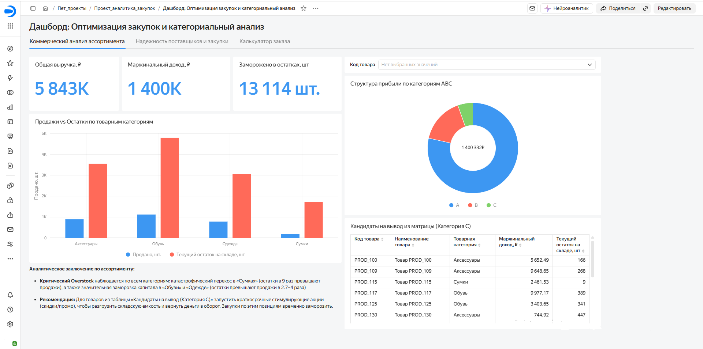
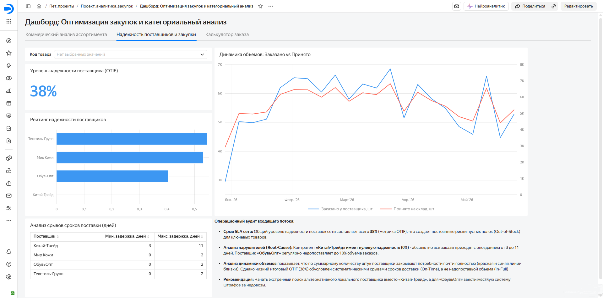
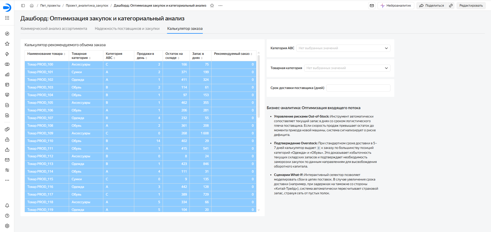

# 🛒 BI-система коммерческого аудита ритейла: Оптимизация закупок, ABC-анализ и оценка OTIF

🔗 **[Посмотреть интерактивный дашборд в Yandex DataLens](https://datalens.yandex/q9sajyaptri8a?_share_link=public)**

---

## 📌 Описание проекта и бизнес-контекст

Торговая сеть столкнулась с падением маржинальности, нехваткой ликвидности из-за заморозки средств в запасах и постоянными рисками пустых полок (Out-of-Stock). 

**Цель проекта:** Разработать сквозную аналитическую BI-систему для коммерческого департамента и логистики, позволяющую:
1. Оценить эффективность товарных категорий и выявить неликвидные позиции.
2. Провести аудит дисциплины поставок по международному стандарту **OTIF (On-Time In-Full)**.
3. Предоставить закупщикам интерактивный инструмент расчета страхового запаса и объема заказов (**What-If калькулятор**).

---

## ⚙️ Архитектура решения и стек технологий

Проект реализован по двухзвенной архитектуре **СУБД → BI-слой**, где разделение ответственности между базой данных и слоем визуализации обеспечивает высокий уровень производительности и гибкости анализа.

### 🛠️ Стек технологий и распределение логики

* **PostgreSQL (Среда разработки: DBeaver):**
  * **Хранение данных:** Проектирование схемы СУБД `supply_chain_db`, импорт, первичная очистка и валидация реестров коммерческих продаж и заказов поставщикам.
  * **Трансформация на уровне БД:** Написание витрины данных (View) `v_abc_sales_analysis` для автоматического расчета маржинальности.
  * **SQL-аналитика:** Использование комбинации CTE (Common Table Expressions) и оконных функций (`SUM() OVER (ORDER BY profit DESC)`) для кумулятивного вычисления доли прибыли каждой позиции и динамического присвоения ABC-категорий.

* **Yandex DataLens:**
  * **Моделирование датасетов:** Разворачивание двух предметных датасетов (анализ ассортимента и надежность снабжения) с оптимизированной структурой полей.
  * **Логистические KPI:** Внедрение вычисляемых полей для динамической оценки поставщиков:
    * **On-Time Rate** - точность соблюдения плановых дат доставки.
    * **In-Full Rate** - полнота выполнения заказа по объему.
    * **OTIF (On-Time In-Full)** - интегральный показатель надежности цепи поставок.
  * **What-If моделирование:** Создание интерактивного калькулятора автозаказа с управляемым параметром `Lead_Time_Days` (срок доставки) для мгновенного перерасчета страхового запаса и точки заказа.
  * **UI/UX и визуализация:** Настройка трехстраничного интерфейса, кросс-фильтрации между виджетами и условного цветового форматирования для подсветки Out-of-Stock рисков.

---

## 📊 Структура дашборда и ключевые инсайты

### 📑 Вкладка 1. Коммерческий анализ ассортимента

* **Анализ структуры прибыли:** На стороне СУБД реализован ABC-анализ. Выявлено размытие ассортиментного профиля (80% маржи генерируется 78% товаров), что указывает на отсутствие выраженных локомотивов продаж и необходимость пересмотра ценовой политики и матрицы.
* **Критический Overstock:** Подсвечен жесткий дисбаланс между остатками и продажами. Наиболее критический перекос зафиксирован в категории **«Сумки»** (остатки превышают продажи в 9 раз), а категории **«Обувь»** и **«Одежда»** замораживают наибольший объем капитала в абсолютных штуках (остатки в 2.7-4 раза выше спроса).
* **Оптимизация матрицы:** Сформирован автоматический реестр *«Кандидатов на вывод из матрицы»* (товары группы C с высокими остатками, но минимальным вкладом в прибыль).

---

### 📑 Вкладка 2. Надежность поставщиков и закупки (OTIF)

* **Низкий уровень сервиса сети:** Общий показатель надежности снабжения **OTIF составляет всего 38%**.
* **Root-Cause анализ нарушителей:**
  * **«Китай-Трейд» (OTIF = 0%):** Главный источник срывов сроков. Анализ дат показал, что поставщик опаздывает со 100% заказов (систематические задержки от **3 до 11 дней**).
  * **«ОбувьОпт»:** Идентифицирован как контрагент с систематическими недовозами штук (недопоставка до 10% от объема заказа).
* **Разделение факторов:** Сравнительный анализ графиков объемов и сроков показал, что провал OTIF вызван именно срывами сроков доставки (**On-Time**), тогда как объемы штук (**In-Full**) поставщиками закрываются почти полностью.

---

### 📑 Вкладка 3. Калькулятор заказа (What-If сценарии)

* **Защита от Out-of-Stock:** Модуль автоматического расчета точки заказа на основе среднесуточных продаж и текущих складских остатков.
* **Моделирование логистического плеча:** Внедрен управляемый параметр `Lead_Time_Days` (Срок доставки). При изменении плеча доставки менеджер мгновенно получает перерасчет страхового запаса и рекомендуемого объема закупки.
* **Визуальные триггеры:** Внедрено условное форматирование, подсвечивающее позиции с дефицитом, требующие срочной отправки заказа.

---

## 🚀 Управленческие рекомендации

1. **Замена контрагента:** Начать поиск альтернативного локального поставщика взамен «Китай-Трейд» или инициировать пересмотр контракта с жесткими штрафами за задержки.
2. **Претензионная работа:** Ввести систему штрафных санкций для «ОбувьОпт» за регулярные недовозы квантов.
3. **Высвобождение ликвидности:** Остановить закупки по категории «Сумки», а по «Одежде» и «Обуви» провести распродажу залежавшихся остатков группы C для высвобождения оборотного капитала.

